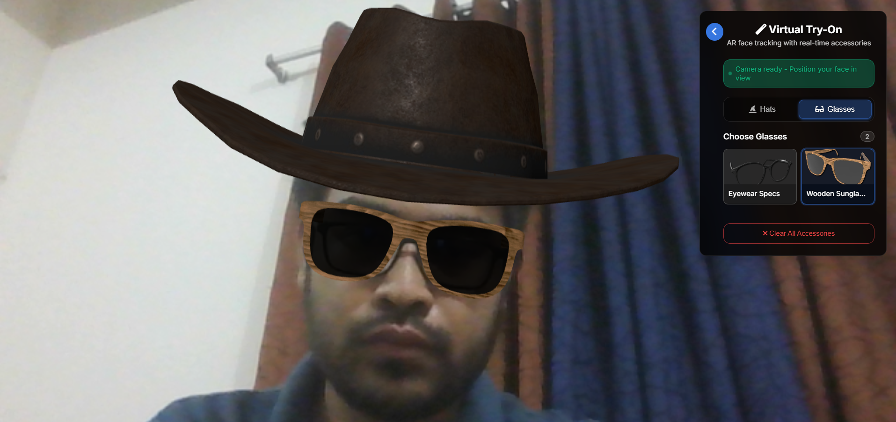

# Virtual Try-On AR (Task 1 Assessment)

Real-time browser-based AR face accessory try-on (hats & glasses) using **MindAR (uses MediaPipe internally) + A-Frame** for face tracking and **FastAPI + SQLModel (SQLite)** for dynamic 3D asset management with an integrated admin interface.

> This repository implements Task 1 of the AI Engineer (Lead Role) Technical Assessment: real-time face detection, 3D accessory overlay (.glb), switching models, and modular documented code with Dockerized deployment.

---

## Features

- **Real-time face tracking** (Webcam → MindAR face landmarks) entirely in-browser.
- **Two accessory categories**: `hats` and `glasses` (extensible via admin panel).
- **Multiple .glb models** with per-model transforms (position / rotation / scale) & optional anchor override.
- **Dynamic model switching** with exclusive selection per category.
- **Admin Panel** (no auth in demo) for:
  - Uploading `.glb` / `.gltf` files.
  - Uploading thumbnails.
  - Editing transforms & anchor index.
  - Activating / deactivating models.
- **Fallback offline mode** if API is unavailable (static default assets load).
- **Responsive UI** with collapsible control panel + selection grid.
- **Docker & docker-compose** for reproducible deployment.
- **Health check endpoint** for container orchestration.

---

## Architecture Overview

| Layer          | Technology                             | Purpose                                  |
| -------------- | -------------------------------------- | ---------------------------------------- |
| Frontend       | A-Frame + MindAR (uses MediaPipe internally) | Face tracking + AR scene composition     |
| Frontend Logic | Vanilla JS (`static/app.js`)         | Model selection, asset loading, UI state |
| Backend        | FastAPI (`app.py`, `modules/*.py`) | API for categories / models / uploads    |
| Persistence    | SQLite via SQLModel                    | Stores accessory metadata & transforms   |
| Assets         | `/models` + `/static/thumbnails`   | 3D binaries & preview images             |
| Container      | Docker + Compose                       | Local + portable runtime                 |

### Data Flow (Simplified)

1. Browser loads `index.html` → initializes `VirtualTryOnApp`.
2. Frontend calls `GET /api/models` → receives grouped models (by category) with transform + anchor metadata.
3. User selects an accessory → frontend ensures asset `<a-asset-item>` exists → injects `<a-entity mindar-face-target>` with transforms.
4. MindAR continuously updates anchor transforms; A-Frame renders model relative to facial landmark.
5. Admin interactions modify DB and asset files → subsequent API calls reflect updates instantly.

---

## Key Directories

```
app.py                       # FastAPI entrypoint
modules/                     # Backend modules
  config.py                  # App + DB init, seeding, asset copy
  main.py                    # Public API routes
  admin.py                   # Admin dashboard + CRUD forms
  models.py                  # SQLModel ORM entities
static/
  app.js                     # Frontend application logic
  app.css                    # Styling (control panel, grid, status)
  thumbnails/                # Model thumbnail images
models/                      # Uploaded .glb/.gltf files (mounted volume in Docker)
templates/                   # Jinja2 templates (index + admin)
Dockerfile
docker-compose.yml
requirements.txt
```

---

## Quick Start (Local)

### Docker

```bash
docker compose up --build -d
```

Open: http://localhost:8000

### 3. First Run Behavior

- Creates `virtual_tryon.db` (SQLite) in working directory or mounted `./data` volume (docker).
- Seeds default categories + default model entries.
- Copies default assets from `data/models` → `models/` + `static/thumbnails/` if present.

---

## Core API Endpoints (Public Demo Scope)

| Method | Endpoint               | Description                                                      |
| ------ | ---------------------- | ---------------------------------------------------------------- |
| GET    | `/api/health`        | Health / readiness probe                                         |
| GET    | `/api/categories`    | List categories with anchor metadata                             |
| GET    | `/api/models`        | Returns models grouped by category                               |
| POST   | `/api/upload`        | Upload new model (used conceptually; UI disabled in public page) |
| DELETE | `/api/models/{uuid}` | Delete model + file                                              |

> Admin HTML endpoints under `/admin` use server-rendered forms (no auth in demo). In production add authentication & authorization.

### Sample `GET /api/models` Response (trimmed)

```json
{
  "status": "success",
  "data": {
    "hats": [
      {
        "id": "hat1-default",
        "name": "Wizard Hat",
        "filename": "hat.glb",
        "position": [0.0, -0.2, -0.7],
        "rotation": [0.0, -90.0, 0.0],
        "scale": [0.27, 0.27, 0.27],
        "anchor_index": 10
      }
    ],
    "glasses": [ ... ]
  }
}
```

---

## Data Model (SQLModel)

### `AccessoryCategory`

- `id`, `name`, `description`, `anchor_index`, `created_at`

### `AccessoryModel`

- `uuid` (public ID), `filename`, `original_filename`, `thumbnail_path`
- `category_id` (FK)
- `position_*`, `rotation_*`, `scale_*`, `anchor_index` (optional override)
- `is_active`, timestamps

---

## Frontend Implementation (`static/app.js`)

Core class: `VirtualTryOnApp`

- Performs compatibility checks (HTTPS, camera, WebGL).
- Fetches models → renders category grids → registers per-card selection handlers.
- Uses A-Frame + MindAR (uses MediaPipe internally) face component: each selected accessory creates an `<a-entity mindar-face-target>` with an embedded `<a-gltf-model>` referencing a dynamically injected asset.
- Exclusive selection by category (only one hat + one glasses at a time).
- Provides offline fallback set if backend unreachable.
- Displays UI feedback via status bar + toast notifications.

> Note: No extra temporal smoothing beyond MindAR's internal filtering; can be extended (see Future Enhancements).

---

## Adding New Models

### Via Admin UI (Recommended)

1. Go to: `http://localhost:8000/admin/models` → "Add Model".
2. Upload `.glb` / `.gltf` file (≤50MB) + optional thumbnail.
3. Set transforms (trial-and-adjust for best fit).
4. (Optional) Override `anchor_index` (e.g., 10 for hats, 168 for glasses bridge).

### Programmatically (API)

`POST /api/upload` (multipart form):

- `file`: model binary (.glb/.gltf)
- `category_name`: `hats` | `glasses`
- `name`, `description`

---

## Environment & Configuration

| Variable         | Default                          | Purpose                               |
| ---------------- | -------------------------------- | ------------------------------------- |
| `DATABASE_URL` | `sqlite:///./virtual_tryon.db` | (Compose overrides to file-backed db) |
| `PYTHONPATH`   | `/app` (Docker)                | Module resolution                     |

> For production use Postgres or managed DB + object storage (S3 / GCS) for models.

---

## Dependencies

Defined in `requirements.txt`:

- `fastapi`, `uvicorn[standard]` – ASGI API
- `sqlmodel` – ORM on SQLAlchemy + Pydantic models
- `python-multipart`, `aiofiles` – Upload handling & async file ops
- `Pillow` – (Potential thumbnail processing hook; not heavily used yet)
- `jinja2` – Templating for admin + index

Frontend CDN:

- `aframe@1.5.0`
- `mind-ar@1.2.5` (face tracking, uses MediaPipe internally)
- `font-awesome`, Google Fonts

---

## Task 1 Requirement Mapping

| Requirement                             | Status | Notes                                                                           |
| --------------------------------------- | ------ | ------------------------------------------------------------------------------- |
| Real-time face detection via webcam     | ✅     | MindAR face tracking component (`mindar-face`)                                |
| At least two 3D accessories (.glb)      | ✅     | Wizard Hat, Cowboy Hat, Eyewear Specs, Wooden Sunglasses                        |
| Support .glb/.gltf                      | ✅     | Validation + serving via `/models` static mount                               |
| Correct positioning & scaling           | ✅     | Manual transforms per model.                                                    |
| Minimal web interface                   | ✅     | Selection grid, live AR viewport, clear controls                                |
| Switching / uploading models            | ✅     | Switching implemented; upload restricted to admin (public page upload disabled) |
| Modular & documented code               | ✅     | Separated modules, comments, structured classes                                 |
| Reproducible setup (requirements + run) | ✅     | + Dockerfile + compose                                                          |
| README & docs                           | ✅     | (This file)                                                                     |
| Optional Docker                         | ✅     | Provided                                                                        |

✅ = Completed

---

## Troubleshooting

| Symptom                    | Cause                           | Fix                                                 |
| -------------------------- | ------------------------------- | --------------------------------------------------- |
| "Camera access denied"     | Permission blocked              | Allow camera + refresh                              |
| Black screen / no tracking | Unsupported browser / HTTP      | Use HTTPS or localhost; Chrome / Safari recommended |
| Models not appearing       | Asset missing or path mismatch  | Check `/models` dir + console network tab         |
| Thumbnails broken          | File not copied / name mismatch | Verify `static/thumbnails/*.png` exists           |
| Upload 400 error           | Wrong file type                 | Use `.glb` / `.gltf` only                       |
| DB not seeded              | Removed `data/models` dir     | Recreate or remove DB file to re-run seeding        |

---

## Code Reading Guide

| File                     | Why It Matters                                |
| ------------------------ | --------------------------------------------- |
| `modules/config.py`    | Startup seeding + FastAPI app factory & CORS  |
| `modules/models.py`    | Defines persistence layer schema              |
| `modules/main.py`      | Public JSON API (models, categories, upload)  |
| `modules/admin.py`     | HTML CRUD forms (model + category management) |
| `static/app.js`        | Core AR & UI orchestration logic              |
| `templates/index.html` | AR scene + dynamic asset container            |

---

## License & Asset Attribution

All the models were collected from Sketchfab

---

## Completion Summary (Task 1)

This implementation fulfills all core Task 1 requirements. Backend + frontend integrate cleanly, containerization provided, and documentation (this README) makes the project reproducible.

## Screen shot of the working application

